EC2起動テンプレート、設定方法(手動)
ステップ1   
AWSコンソール>CloudFormation>スタックの作成>新しいリソースを使用  
スタックの作成>テンプレートの準備完了>テンプレートファイルのアップロード
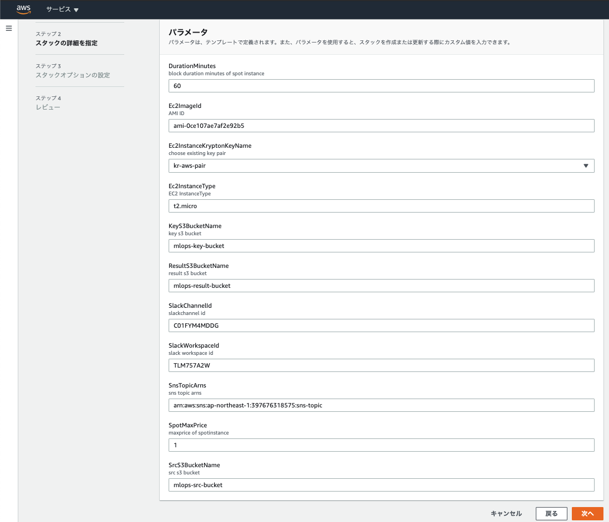
ステップ2  
次へ>スタックの名前を適当に入力する
その他のパラメータ  
DurationMinutes:(Number) SpotInstanceの最大起動時間、この時間を超過するとスポットインスタンスは停止する。時間制限を設けない場合-1と入力する  
60の倍数で指定する  
Ec2ImageID:(String) image id  
Ec2InstanceKryptonKeyName:(KeyPair) 使う公開鍵を指定する  
SrcS3BucketName:(String) ソースコード,データを置くS3バケット名
ResultS3BucketName:(String) 結果を置くS3バケット名
Ec2InstanceType:(String) instance type  
SalckChannelID:(String) 通知先のチャンネルIDを入力する  
SlackWorkspaceID:(String) SlackのワークスペースID  
SnsTopicArns:(String) SNS設定  
SpotMaxPrice:(String) ドル単位で指定, この価格を超過するとスポットインスタンスは停止する
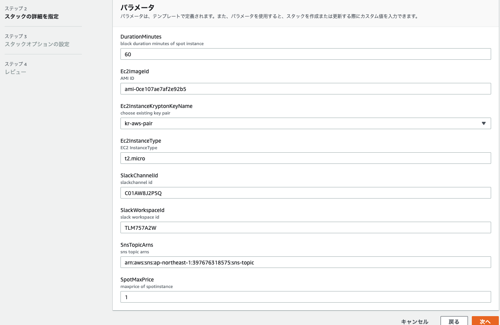
最初に立ち上げる時は既存のキーペアを選択する、存在しない場合は下記を参考に設定する  
[Amazon EC2 キーペアの作成](https://docs.aws.amazon.com/ja_jp/amazondynamodb/latest/developerguide/EMRforDynamoDB.Tutorial.EC2KeyPair.html)  

ステップ3は設定せず次へを押す  
ステップ4
下記のチェックボックスにチェックを付ける  
(Lambda用にIAMが作られるため、その警告です)
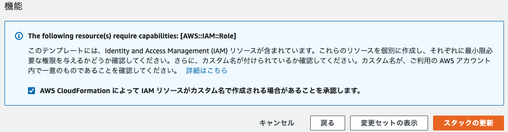  
「スタック」の作成を押す　　
上記の手順で  
SpotInstanceの起動テンプレート(1)
s3バケット(3)
Lambda(2)
Chatbot(1)
が作成される

## EC2へのログイン方法

```
{ echo "mkdir -p ~/.ssh"; echo "echo \"`kr me 2>/dev/null`\" >> ~/.ssh/authorized_keys"; sleep 1; echo "chmod 600 ~/.ssh/authorized_keys"; sleep 1; echo exit; sleep 10;} | sh -c "aws ssm --target [instance-id]"
```


## 案件ごとに変更する箇所
```
UserData:
          Fn::Base64: |
```

## 作成しているs3バケット(デフォルト名)
```mlops-src-bucket```:ソースコード、データ等置く  
```mlops-result-bucket```:学習結果の転送先  
## 現在の構成図
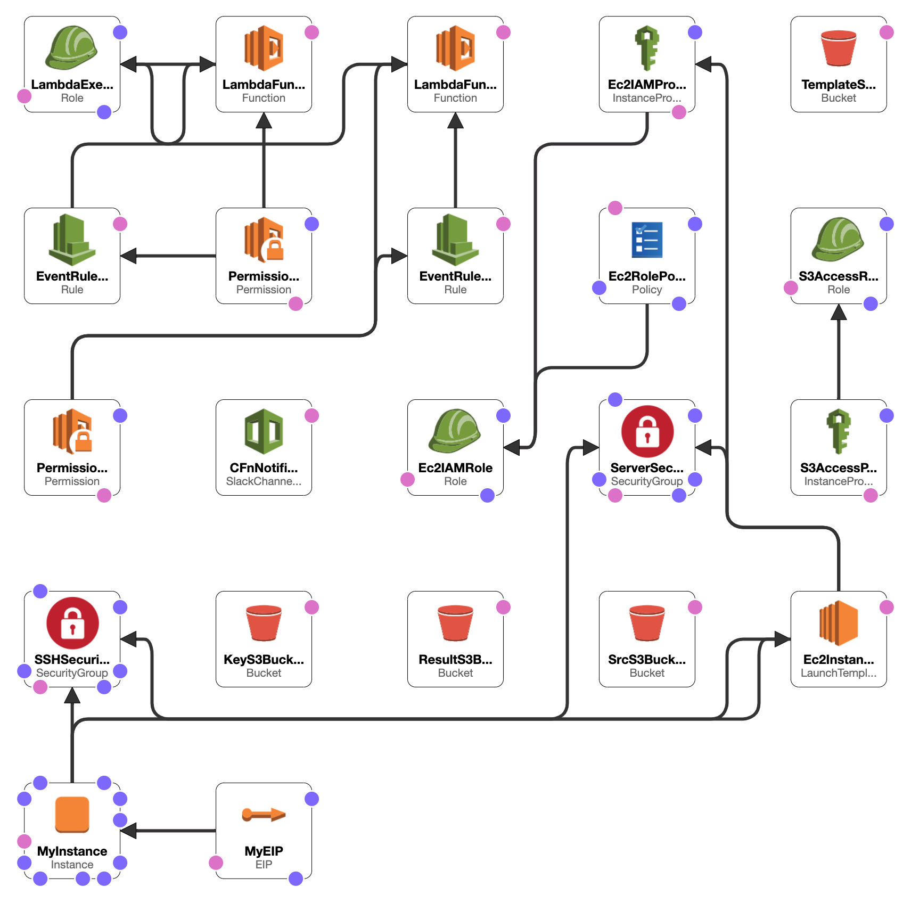

## Slack通知  
### ChatBot
CFnの変更、作成時にSlackに通知を送信する
### Lambda
1.
LambdaFunctionInstanceStateChange  
監視対象のInstanceの起動、終了をSlackに通知する

2.
LambdaFunctionSpotInstance  
監視対象のSpotInstanceの2分前終了通知を受け取り、Slackに通知する

### 動作例
MaxPrice: 1  
DurationMinutes: 60  
でt2.microを立ち上げた場合下記のように通知がくる  
t2.microでは1$に到達しないため、開始時点から約60分後に終了する  
中断通知はその2分前である58分後に通知される

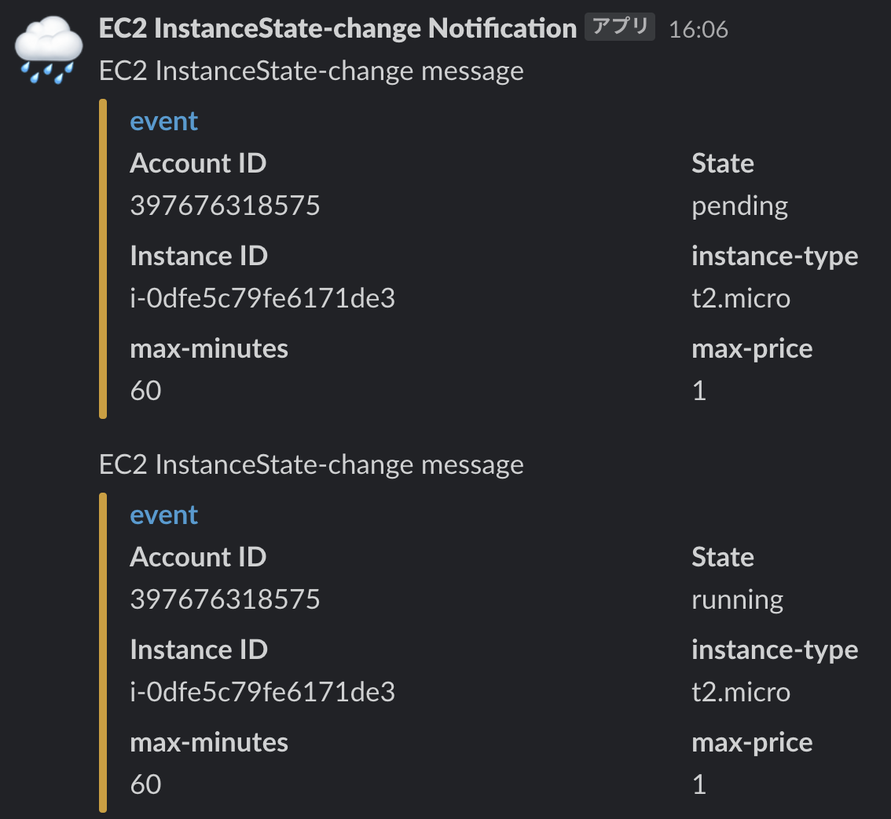
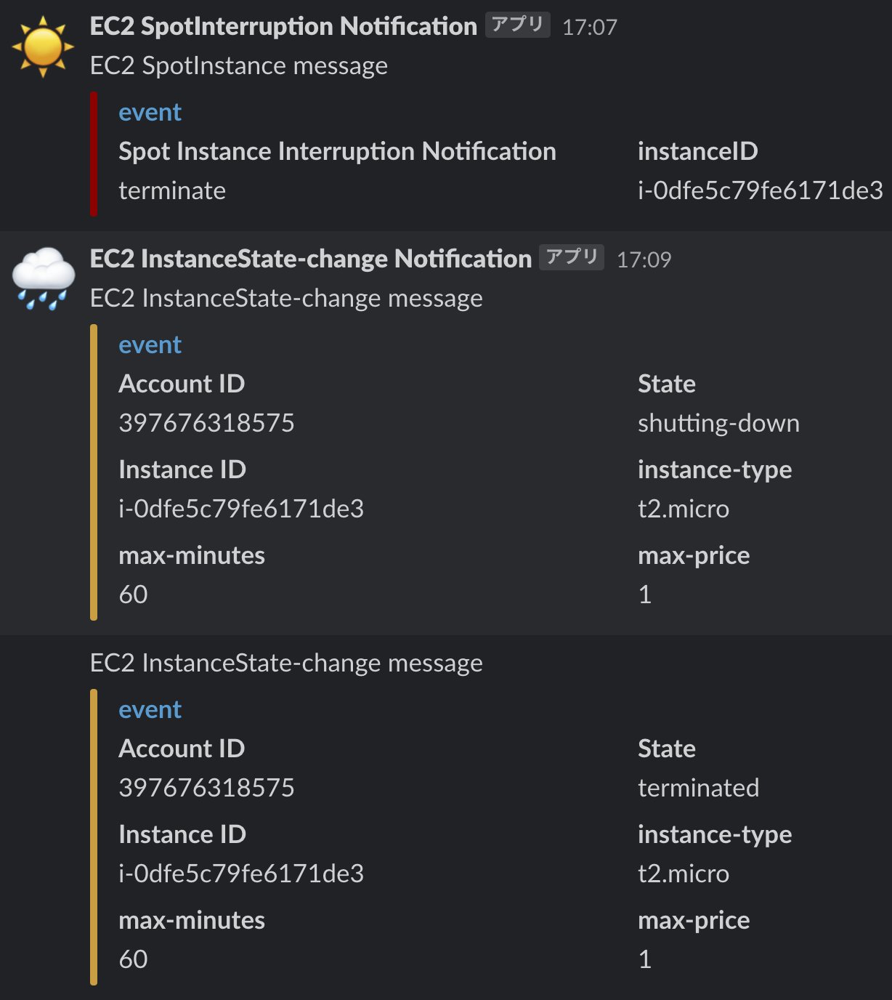

#### 既存のテンプレートからの起動
AWSコンソールにログイン>EC2>左上メニュー>起動テンプレート
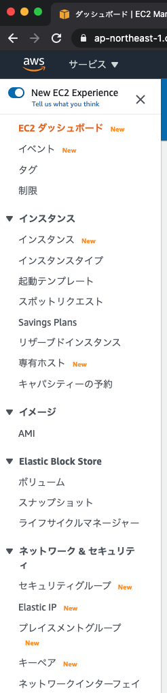
ユーザーデータ(起動時に実行されるスクリプト)を変更する場合
使用したいテンプレートを選択>テンプレートからインスタンスを起動>高度な詳細>ユーザーデータ
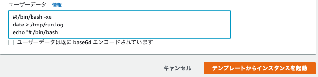

ユーザーデータを変更しない場合
使用したいテンプレートを選択>アクション>テンプレートからインスタンスを起動
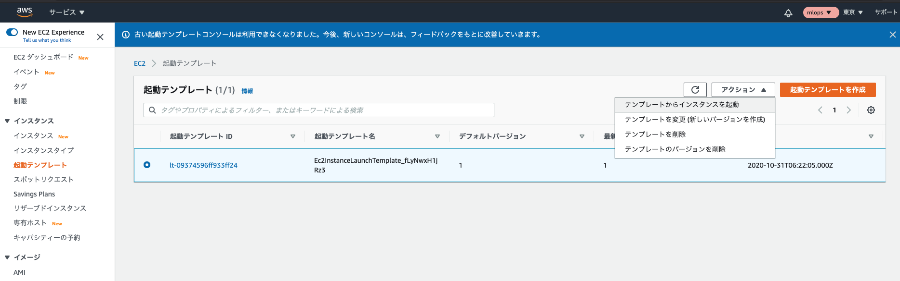
#### 注意点
・手動終了の場合2分前終了通知はこない
・スポットの場合、コンソールから終了ができない  
(You can't stop the Spot Instance 'i-******' because it is in a Spot block, indicated by BlockDurationMinutes.)
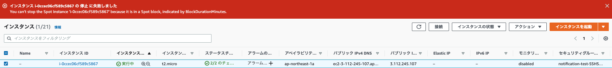
・Chatbotは一つのチャンネルに一つまで

##### 請求中、実行中のスポットインスタンスの確認
請求したスポットインスタンスをコンソールから確認したい場合
コンソール>EC2>スポットリクエスト
submitted, active, closed, disabled
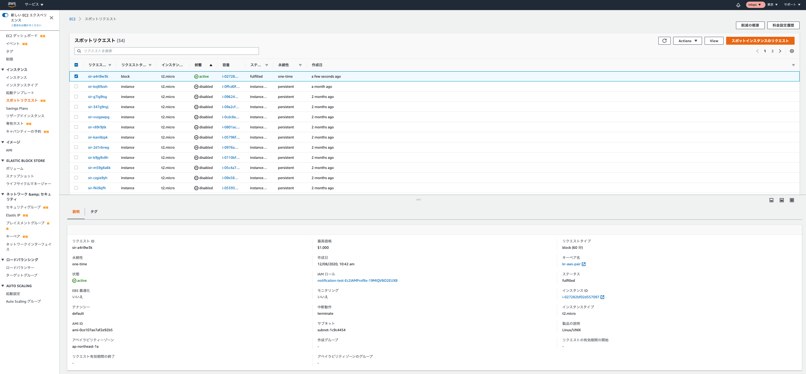
リクエストを取り消したい場合  
Actions>リクエストをキャンセル
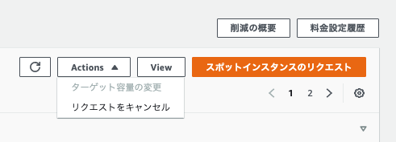
